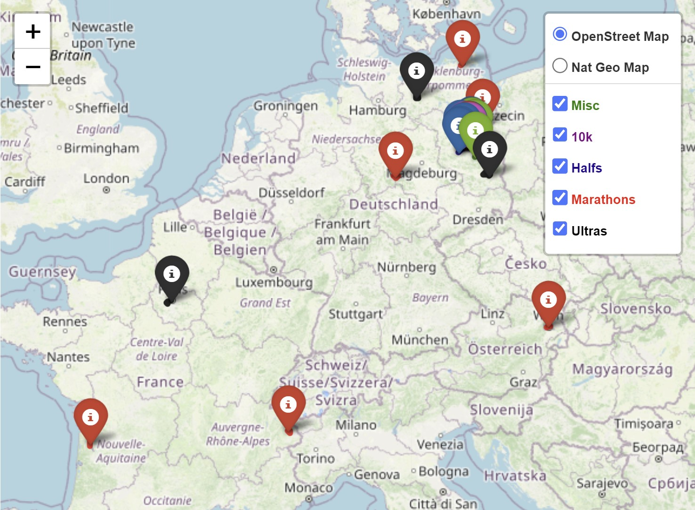

# Run Map
#### A map of race events I took part in, with gpx traces and pop-up race information, entirely generated from a google spreadsheet.

  

*Click picture to display full map*

The map is displayed on my [running blog](https://run.alexdjulin.ovh/p/events.html). It is mainly using the [Folium](https://python-visualization.github.io/folium/) python library. The base layer relies on [OpenStreetMap](https://www.openstreetmap.org/).

All events are loaded from a [google spreadsheet](https://docs.google.com/spreadsheets/d/1FXP3QcYiCeogYNgArd5mPY109RgAOhP6FKQDWqgV4YU/edit#gid=1032862300). This is the only part that I edit: html map, events table and the event-o-meter gadget are generated automatically from it.

When clicking on markers, a **pop-up window** gives additonal information about the race (photo, name, place, date, distance, time, event link, blog post, etc). The pop-up is using an **HTML template**. Its content is generated dynamically for each event based on infos extracted from the google spreadsheet.

Event trace segments are created from **GPX** files recorded by my watch during the race.

Events and gpx traces are color-coded based on the distance. A **legend** offers to blend them in and out.

#### Files description:
- **settings.json**: Defines all paths and settings to build the map.
- **csv/events.csv**: Downloaded from the google spreadsheet. Contains all events information.
- **html/popup_contents.html**: Contains the html template used to display the pop-ups. Fields contained in {} will be replaced by the corresponding information from the csv file. Example: {link}.
- **html/events_table.html**: HTML table displayed inside an iframe on the Event page below the map. Simplified version of the spreadsheet with main information only.
- **html/events_table_template.html**: Template used to build events_table.html
- **html/eventometer.html**: HTML gadget displayed inside an iframe on the Home page side bar. List statistics based on spreadsheet (total km/d+, number of halfs, marathons and ultras).
- **html/eventometer_template.html**: Template used to build eventometer.html
- **run_map.html**: HTML file generated by run_map.py. The folium map is displayed inside an iframe on the Event page.
- **run_map.py**: Main class and methods to generate a map.
- **main.py**: Main method generating run_map.html.
- **JPG**: Folder containing jpg images for the pop-ups.
- **GPX**: Folder containing gpx traces to create the segments.

Note: A new map (run_map.html) should be generated everytime the google spreadsheet or the html templates are changing.
